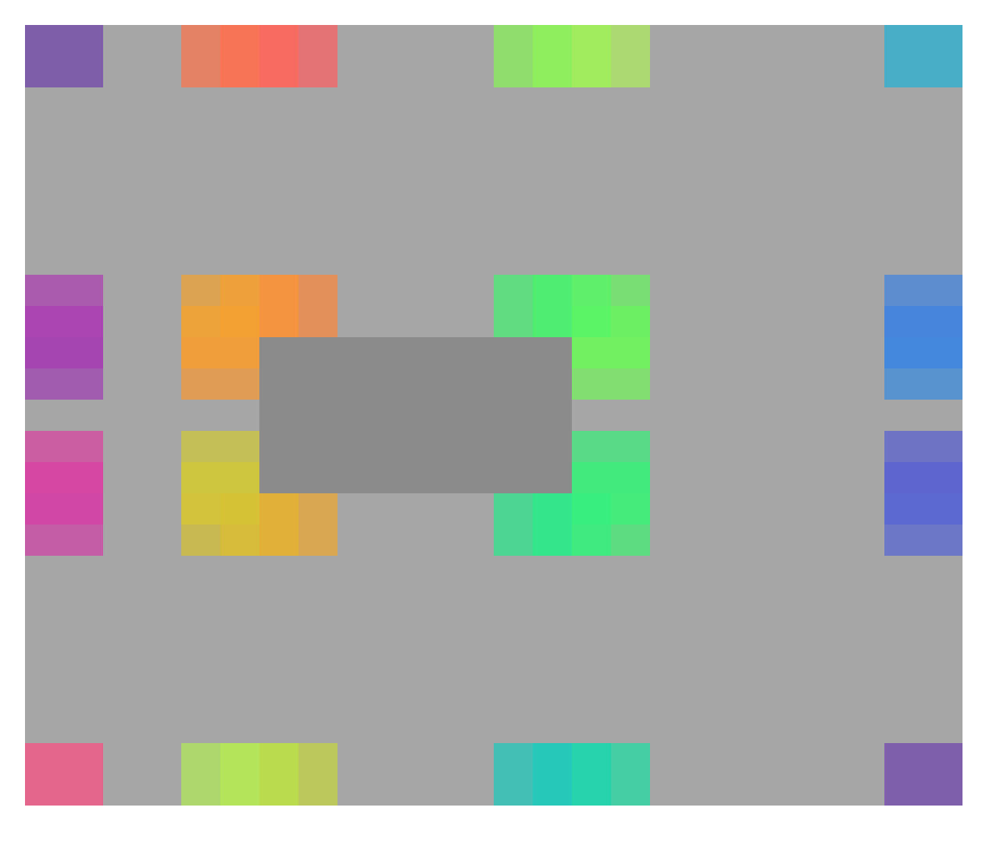

# ringside [](https://github.com/rylnd/ringside/actions/workflows/ci.yml) [](https://circleci.com/gh/rylnd/ringside)

A library that determines the fit and positioning of a rectangle relative to inner and outer bounds.

## Installation

```bash
npm install ringside
```

## Usage

Here's how you might generate the positioning for a tooltip:

```jsx
import Ringside from 'ringside';

// define our target tooltip size
const tooltipSize = {
  height: 100,
  width: 200
};

// grab our target element and its container
const container = document.querySelector('.container');
const target = container.querySelector('.target');

const ringside = new Ringside(
  target.getBoundingClientRect(),     // target bounds
  container.getBoundingClientRect(),  // container bounds
  tooltipSize.height,
  tooltipSize.width
);

// select all positions that will fit
const possiblePositions = ringside
  .positions()
  .filter(position => position.fits);

// select a position from those that fit
const [position] = possiblePositions;

// and use it!
const tooltipPosition = {
  top: position.top,
  left: position.left,
  height: tooltipSize.height,
  width: tooltipSize.width
};
```

## Examples

Each candidate position is colored below: the dark gray box is the target (inner bounds), the light gray area is its container (outer bounds), and each color is a position that would fit.



This repo's storybook documents the different ways to use this library.

To run it, from a clone of this repo:

```bash
npm install
npm run storybook
```

For more examples, check the [examples repo](https://github.com/rylnd/ringside-examples).

## Development

```bash
# use the Node version from .nvmrc
nvm use

# install packages
npm install

# run tests
npm test
```
